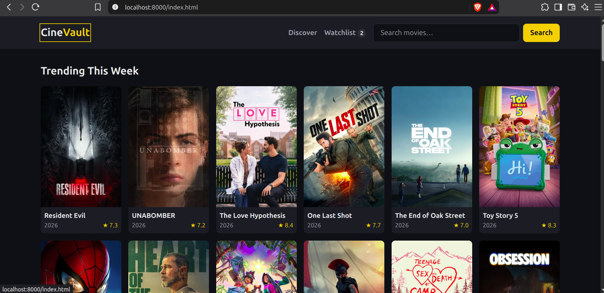

# CineVault

A multi-page movie discovery site built with vanilla JavaScript and the TMDB API.



## Features

- **Home page** – Trending this week, Popular right now, and Top rated of all time, each with loading and error states.
- **Movie details** – Backdrop, poster, tagline, release year, runtime, rating, genres, overview, the top 12 cast members, and the official YouTube trailer. Missing or invalid movie IDs show a friendly message.
- **Search** – A search box in the header on every page. On the search page, results update as you type (debounced), and the query lives in the URL (`search.html?query=dune`) so searches can be bookmarked and shared.
- **Discover** – Filter by one or more genres, release year, and sort order (most popular, highest rated, newest). Filters are stored in the URL and work with the back button. "Load more" appends the next page without duplicates.
- **Watchlist** – Save movies from the details page and manage them on the watchlist page. The header shows a live count, and changes sync across open tabs. Stored in `localStorage`, so no account is needed.
- **Responsive and keyboard-friendly** – Works on phone and desktop, with labelled inputs, visible focus styles, and screen-reader announcements for results and state changes.

## Tech stack

- HTML, CSS (custom properties, BEM naming)
- Vanilla JavaScript with ES modules
- [TMDB API](https://developer.themoviedb.org/docs)
- No frameworks, libraries, or build tools

## Project structure

```
cinevault/
├── *.html            # One page per view: index, movie, search, discover, watchlist
├── assets/images/    # Static images, such as the placeholder poster
├── css/
│   ├── variables.css  # Design tokens: colors, spacing, radius
│   ├── base.css       # Resets and global element styles
│   ├── layout.css     # Container, header, and grid layout
│   ├── components.css # Styles for reusable components
│   └── pages/        # Styles used by a single page
└── js/
    ├── config.example.js  # Template for js/config.js (which is gitignored)
    ├── api/          # tmdb.js: the only file that calls the TMDB API
    ├── components/   # Reusable UI: header, movie card, cast card, feedback, watchlist button
    ├── pages/        # One controller per HTML page
    └── utils/        # Helpers: DOM, formatting, debounce, localStorage
```

## Getting started

1. **Clone the repo**

   ```bash
   git clone https://github.com/govind-png/cinevault.git
   cd cinevault
   ```

2. **Create your config file**

   ```bash
   cp js/config.example.js js/config.js
   ```

3. **Add your TMDB token.** Create a free account on [themoviedb.org](https://www.themoviedb.org), go to [Settings → API](https://www.themoviedb.org/settings/api), and copy the **API Read Access Token**. Paste it into `js/config.js` in place of `YOUR_TMDB_READ_ACCESS_TOKEN`.

4. **Start a local server** from the project folder

   ```bash
   python3 -m http.server 8000
   ```

5. Open **http://localhost:8000**.

> **Why a local server?** The JavaScript is split into ES modules (`import`/`export`). Browsers block module scripts on pages opened directly from disk (`file://` URLs) for security reasons, so if you double-click `index.html` no movies load. Serving the files over `http://` fixes this.

## Security note

- `js/config.js` holds your real token and is listed in `.gitignore`, so it is never committed.
- `js/config.example.js` is committed and must only ever contain the placeholder. Never put a real token in it.
- **Limitation:** this is a front-end-only app, so the token is sent from the browser and anyone using the site can see it in the developer tools. That is fine for local development with a read-only token, but not for a public deployment. A small server-side proxy that keeps the token private is planned before deploying.

## What I learned

- **Data layer** – Keeping every API call in one module (`js/api/tmdb.js`) so pages never deal with URLs, headers, or error codes directly.
- **Reusable components** – Functions like `createMovieCard` and `renderHeader` that build UI once and get used on every page.
- **fetch with async/await** – Loading data, checking `response.ok`, and handling errors with `try`/`catch`, including loading and error states in the UI.
- **XSS-safe rendering** – Putting API data on the page with `textContent` instead of `innerHTML`, so text from the API can never run as HTML or script.
- **Debouncing** – Waiting until the user stops typing before searching, and ignoring slow responses that arrive after newer ones.
- **localStorage** – Saving the watchlist as JSON (`JSON.stringify` / `JSON.parse`), with a safe fallback when the stored data is missing or corrupted.
- **URL state** – Using `URLSearchParams` and the History API so searches and filters can be bookmarked, shared, and restored with the back button.
- **Feature branches** – Building each feature on its own Git branch and merging it into `main` once it has been tested.

## Roadmap

- **Polish** – Further responsive and accessibility improvements.
- **Deployment** – Add a server-side proxy for the TMDB token and publish the site.

## Attribution

This product uses the TMDB API but is not endorsed or certified by TMDB.

Movie data and images are provided by [The Movie Database (TMDB)](https://www.themoviedb.org).
